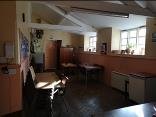
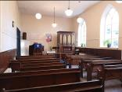
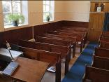

# SOULDERN CHAPEL: THE NEXT CHAPTER

* [Chapel Home Page](/chapel/)
* [Chapel History](/chapel/history-of-souldern-chapel/)
* [Next Chapter Newsletter (PDF)](Souldern Chapel Newsletter Nov20.pdf)
* [The Next Chapter](#nextchapter)
* [Village Hall and Chapel](#twoassets)
* [How to get involved](#getinvolved)

## The Next Chapter {#background}

The last service was held in the Chapel in February 2019 and then
after another year of unsuccessfully trying to encourage increased
attendance, the painful decision was taken to close permanently from
April 2020.

---

## The Opportunity {#opportunity}

The trustees of the Wesleyan Chapel are now going to
have to sell the building, which Souldern village is being given the
opportunity to buy at a preferential price. This offer is being made
in good faith on the condition that the building must be used for the
promotion of community wellbeing, village activities and social
gatherings. All proceeds from this sale will be returned to The
Wesleyan Reform Union of Churches for their central funds.

Following preliminary discussion with the Trustees, the village is
being given the time to put a plan together that will secure the
building for future generations. If collectively we do not act now,
the Chapel building will be sold to a third party.

## Reorganisation of two community assets and split of uses

If collectively we have the appetite to purchase the Chapel, there
are three registered charities in the village under whose ownership
the Chapel could be placed:

* Souldern United Charity – managed by village trustees
* St Mary’s Church – owned by the Church of England and
managed by the Parochial Church Council (villagers)
* Souldern Village Hall – managed by village trustees

In discussions to date, the steering group believe that the best
fit will be the Village Hall charity. It would allow two important
village buildings to be used in conjunction with one another to
support a wider variety of activities and uses. This would also avoid
conflict between the two buildings.

**The Chapel**, being a smaller more intimate venue is better suited to
host fixed activities such as Sunday School, youth club, toddlers
group, sports and social club, occasional Chapel events and after
Church gatherings.

This option would also enable the Chapel to
become the new base for a permanent village reading room and to
establish a central archive for the many village photos, maps and
documents we collectively wish to retain.

**The Village Hall**, with its larger capacity and ample car
parking, would be more focussed on larger gatherings, classes and
external bookings.

Historically, management groups have grappled
with the task of raising the finances required to maintain community
assets and to cover the day to day running costs. It is proposed that
to overcome this hurdle, parishioners will be invited to become
members of a village society and pay an annual subscription which will
cover entrance and use of both venues, (membership terms and
conditions of which are still to be agreed).  Subscriptions for
corporate and not for profit organisations will also be available,
plus additional income from external bookings.

We would really value your input, ideas and thoughts on how the
Chapel might be repurposed.  You can email us via
[ChapelProject@souldern.org](mailto:ChapelProject@souldern.org)

## Frequently Aked Questions (FAQ) {#faq}

Please contact any of the following to find out more:

>   Nick Oakhill,
>   Ian Gray,
>   Jon How,
>   Joanna Carlisle,
>   Barbara McGarry,
>   Lucy Cornish,
>   Charlie Jones,
>   John Hoodless,
>   Susan Jones.
