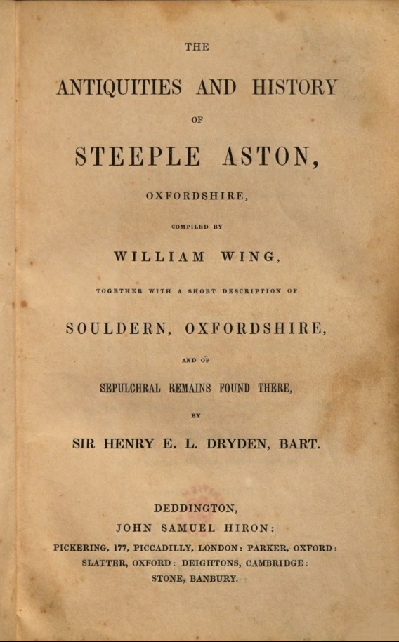

### A SHORT ACCOUNT OF THE
## PARISH OF SOULDERN,
### OXFORDSHIRE.

The following chapter is taken from from &ldquo;The antiquities and history of Steeple Aston, Oxfordshire / compiled by William Wing, together with a short description of Souldern, Oxfordshire, and of sepulchral remains found there, by ... Henry E.L. Dryden&ldquo; compiled by William Wing in 1845.

[Sir Henry Dryden of Canons Ashby](https://www.nationaltrust.org.uk/canons-ashby/features/sir-henry-dryden-the-antiquary)

The book is in the British Library available as an [ebook](http://access.bl.uk/item/viewer/ark:/81055/vdc_100048351802.0x000001#?c=0&m=0&s=0&cv=0&xywh=-575%2C0%2C2700%2C2463). This extract is available for Non commercial use as allowed by the licence.

[Dryden Account of Souldern 1845](dryden.html)

