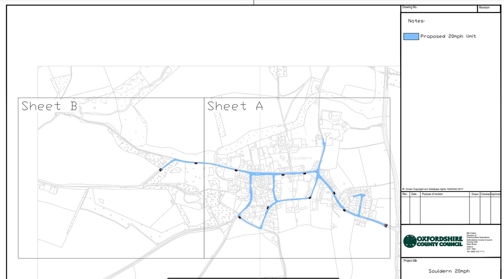

# CONSULTATION – Souldern proposed 20mph Speed Limits

Oxfordshire County Council wants to make our built environments safer
and more attractive places to walk and cycle. To enable this, 20mph
speed restrictions are being used to help promote alternative modes of
transport for local travel. Further details on how the council is
considering making 20mph the new 30mph for Oxfordshire communities can
be found [here](https://www.oxfordshire.gov.uk/residents/roads-and-transport/traffic/20mph-scheme/20mph-transformation-programme).

 

We're therefore asking for your views on the proposal to introduce a
20mph speed within Souldern, replacing the existing 30mph speed limits
in their entirety. The proposals are being put forward following road
safety concerns raised by the parish, and form part of a countywide
programme of works that seeks to deliver ‘a safer place with a safer
pace’ for the residents of Oxfordshire. In light of this please find
the following consultation documents attached:

 

 * [Public Notice](20mph/Souldern 20mph Speed Limit - PUBLIC NOTICE.pdf)
 * [Statement of Reasons](20mph/Souldern 20mph Speed Limit - STATEMENT OF REASONS.pdf)
 * [Consultation Plan(s)](20mph/Souldern 20mph Speed Limit - CONSULTATION PLAN.pdf)
 * [Draft Traffic Regulation Order(s)](20mph/Souldern Speed Limits - DRAFT ORDER 2024.pdf)

 

The proposed Traffic Regulation Order is scheduled to be advertised in
the Bicester Advertiser newspaper today; Thursday 16th May 2024, and
details are also available to view on the Councils consultation portal
at the address below:

 

<https://letstalk.oxfordshire.gov.uk/souldern_20mph2024>

 

As stated on the notice, any objections or other representations on
the proposal should be submitted by **Friday 07th June 2024**.

 

Note. parish & town councils and local Cllrs (County, District, Parish
etc..) are all encouraged to use the information contained within &
attached to this email to publicise the proposals locally amongst
their residents as necessary.

 

Kind Regards,

 

Christian

(Mr) Christian Mauz  
Senior Officer (TRO and Schemes)

Network Management|Highways & Operations|Environment & Place

Oxfordshire County Council|County Hall|New Road|Oxford|OX1 1ND

