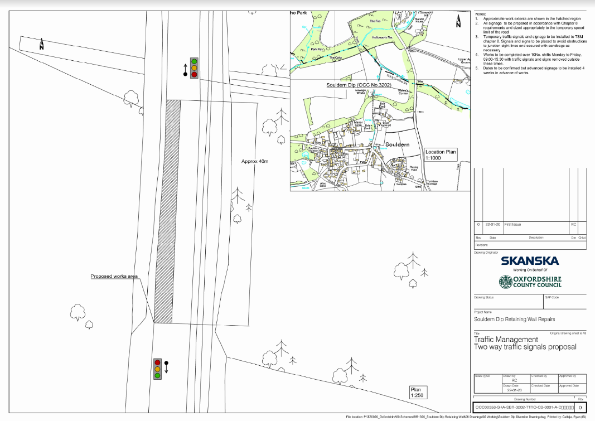

# Temporary Traffic Regulation Order – S14 Road Traffic Regulation Act 1984
# Temporary 40 mph Speed Restriction at Souldern, B4100 Souldern Dip

In the interests of public safety it will be necessary for Oxfordshire
County Council to close a section of B4100 for an approximate length
of 400 metres to facilitate repairs of Souldern dip retaining wall.

 

A Temporary Traffic Regulation Order (TTRO) is being made to implement
the temporary speed restriction and will operate from 20 July 2020 up
to and including 31 July 2020. This will operate between 09:00 and
15:30

 

(The maximum duration of a TTRO on a road is 18 months and on a
footpath is 6 months, or until completion of the works, whichever is
the earlier.)

 

Notice of intention to make the Order will be published in the local press.

 

Access will be maintained for emergency service vehicles and for those
frontages within the closure area, subject to the progress of the
works and liaison with the works supervisor.

 

A copy of the drawing showing the extent of the restriction is attached.

Further information regarding the works may be obtained by contacting Ryan Calleja, Oxfordshire County Council on 0345 310 11 11.

