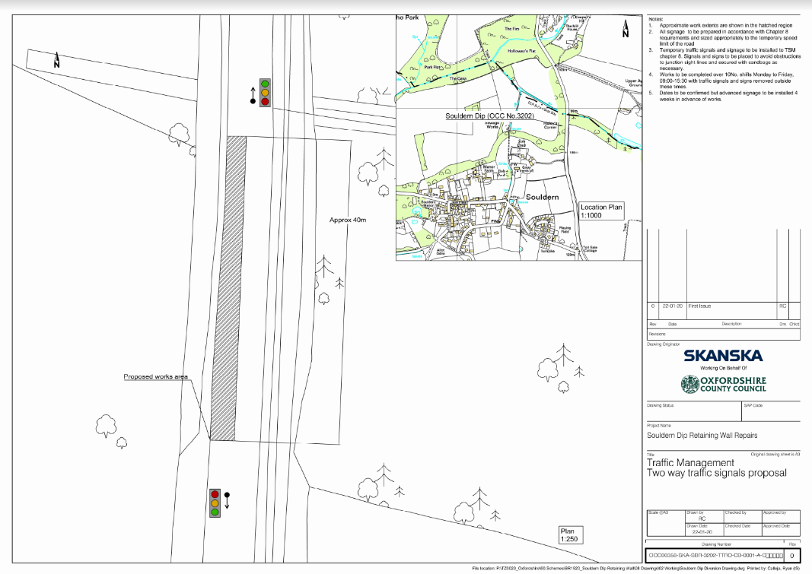

# Temporary Traffic Regulation Order – S14 Road Traffic Regulation Act 1984
# Temporary 40 mph Speed Restriction at Souldern, B4100 Souldern Dip

In the interests of public safety it will be necessary for Oxfordshire
County Council to impose a 40 mph speed limit restriction on the above
site due to repairs of a retaining wall for safety reasons.

 

A Temporary Traffic Regulation Order (TTRO) is being made to implement
the temporary restriction and will operate from **18 May 2020** up to and
including **29 May 2020**.

 

(The maximum duration of a TTRO on a road is 18 months and on a
footpath is 6 months, or until completion of the works, whichever is
the earlier.)

 

Notice of intention to make the Order will be published in the local press.

 

Access will be maintained for emergency service vehicles and for those
frontages within the closure area, subject to the progress of the
works and liaison with the works supervisor.

 

A copy of the drawing showing the extent of the restriction is attached.

     

