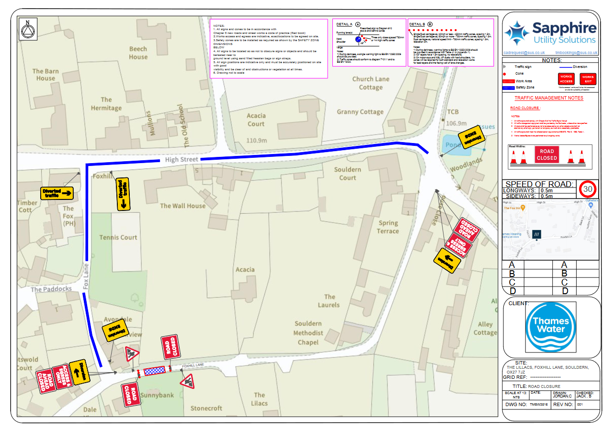

# Temporary Traffic Regulation Notice – S14 Road Traffic Regulation Act 1984

## Temporary Emergency Road Closure – at Souldern, Back Lane

 

Oxfordshire County Council has been informed of a temporary emergency
road closure on Back Lane whilst boundary box exchange works are
carried out for public safety reasons.

 

A temporary Emergency Notice is being made to implement the temporary
closure and will operate from 30 January 2024.

The anticipated completion date is 1 February 2024, 24 hours per day.

 

Access will be maintained for emergency service vehicles and for those
frontages within the closure area, subject to the progress of the
works and liaison with the works supervisor.

 

Further information regarding the emergency works may be obtained by
contacting Thames Water helpline on 0800 316 9800.

 

 

----

T 13419 / RAG

  

Robert Graham  
Officer (TTRO Team)  
Network Co-ordination  
07741 607617

Oxfordshire County Council,  
Ron Groves House,  
Oxford Road,  
Kidlington,  
Oxfordshire,  
OX5 2BP

    