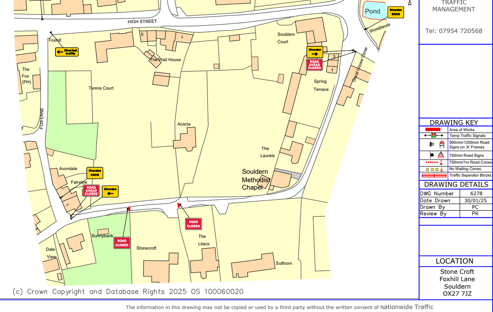

## Temporary Traffic Regulation Notice – S14 Road Traffic Regulation Act 1984

# Temporary Road Closure at Back Lane, Souldern

 

A request has been received from Link Groundworks Bicester Ltd for a
temporary road closure to apply to a length of Back Lane, whilst
essential new sewer connection works are carried out.

 

A temporary Notice is being made by Oxfordshire County Council to
implement the temporary restriction and will operate from **26/8/2025 up
to and including 29/8/2025**.

 

Please note that Notices for urgent works can last up to 5 consecutive
days only.

 

A copy of the drawing showing the extent of the closure and also the
alternative routes for traffic is attached.

SUGGESTED ALTERNATIVE ROUTE: Fox Lane, High Street, Back Lane
and Vice Versa.

Further information regarding the works may be obtained by contacting
Link Groundworks Ltd on info@linkgroundworks.co.uk

 

T16257 / RMF