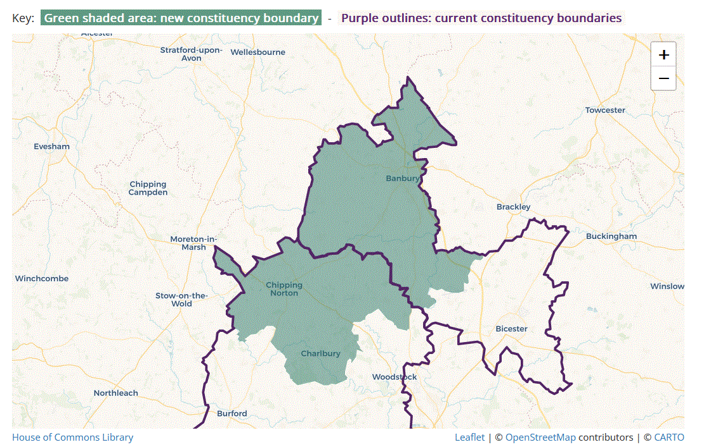

# Local Candidates For the General Election 2024

## Banbury Constituency

Nominations have now closed and the list of candidates is as below.

Note: the Banbury constituency has new boundaries and we are (just)
still in Banbury consutituency, which has lost Bicester and gained Chipping
Norton.

## Voting

Voting due to take place on **Thursday 4 July** in the Village Hall.

## Candidates

|  |    Conservative | Victoria Prentis |
|  |    Labour | Sean Woodcock |
|  |     Liberal Democrat | Liz Adams |
|  |    Green | Arron Baker |
|  |    Reform UK | Richard Farmer |
|  |    Social Democratic Party | Declan Soper |

