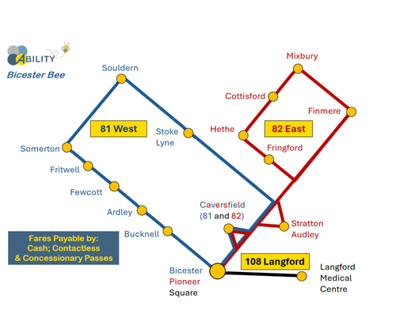

# Bicester Bee Bus Service

More buses for rural areas.

[ABILITY](https://www.abilitycic.org.uk) are to commence three new 
timetabled services in the Bicester area.

The new Bicester Bee service will commence at 
07:22 from Finmere on **1st July 2024**, financially 
supported by Oxfordshire County Council.

Fares will be introduced at **£2 per journey**.

Operating on a timetable 6 days a week, **Monday** to **Saturday**.

Regular
services into Bicester Town and Langford Medical Centre. Fares are
payable by, Cash, Contactless, or by Concessionary Bus Passes. The bus
service is open to all.

Timetables are on the [ability website](https://abilitycic.org.uk/) and visible at each bus stop.

A copy of the [**timetable** is available on this site](bicester-bee-timetable-2024.pdf)

 * 82: Finmere, Mixbury, Cottisford, Hethe, Fringford, Stratton Audley, Caversfield

 * **81**: Caversfield, Stoke Lyne, **Souldern**, Somerton, Fritwell, Fewcott, Ardley, Bucknell

 * 108: Bicester, Langford Medical Centre

[admin@abilitycic.org.uk](mailto:admin@abilitycic.org.uk)  
[www.abilitycic.org.uk](https://www.abilitycic.org.uk)

