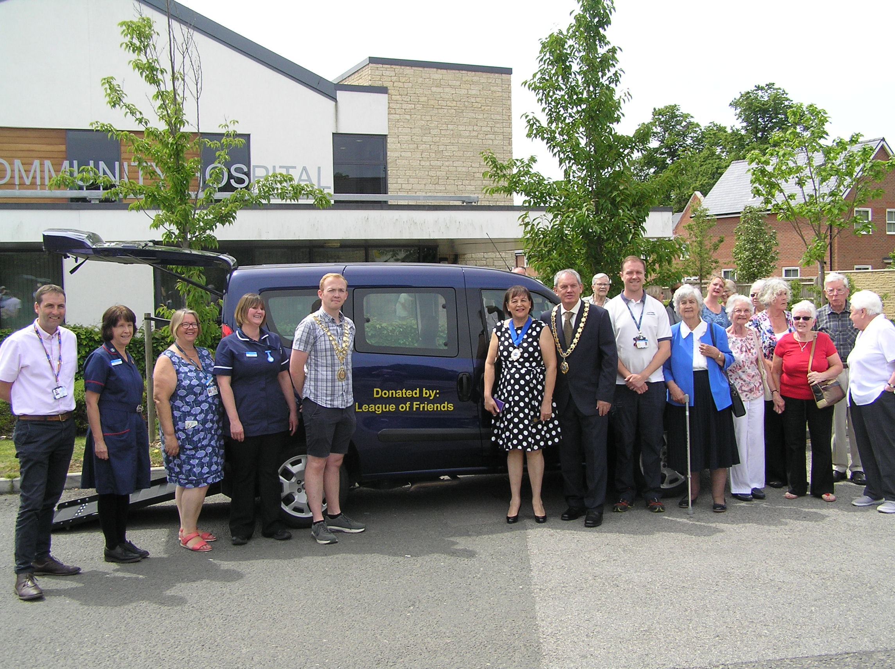

A ceremony took place at Bicester Community Hospital recently to mark the
handover of a specially adapted vehicle purchased for the hospital by Bicester
Community Hospital League of Friends, (LOF).

The new vehicle was handed over to the Therapy Team by the LOF Chairman
Wendy Wright, at a special presentation attended by The Mayor of Bicester,
Jason Slaymaker, Councillor Les Sibley Chairman of Oxfordshire County Council
and his Consort and wife Mrs Mary Sibley, representatives from the NHS,
Bicester Community hospital staff and members of the League of Friends.

The vehicle which replaces an older one previously donated by the LOF will be
used for transporting patients with restricted mobility to their own homes for
an in home assessment. The vehicle is specially adapted to include an electric
winch, which enables the wheelchair bound patient to be assisted into the
vehicle easily, via a ramp.

Patients due to be discharged, are taken to their own homes accompanied by a
member of the Therapy Team (Oxfordshire Health Care Support Services). An
assessment is carried out as to what aids they need and arrangements are then
made for them to be implemented, before the patient returns home.
“The League of Friends work hard to support Bicester Community hospital by
fundraising to supply equipment not provided by the NHS,” said Wendy
Wright, Chairman, LOF. “They also give their time helping on the wards by bed
making, serving teas and interacting with the patients.”

After the ceremony, the members and guests were entertained to a cream tea
in the hospital garden, where they were waited on by hospital staff and nurses
as a thank you for all the help and support given by the League throughout the
year.

For further information about how to become involved with the League of
Friends please call Wendy on 01869 252246

Date 20th June 2019
