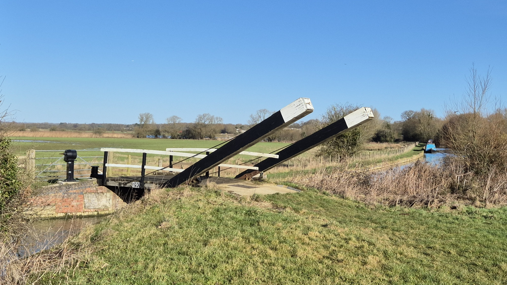
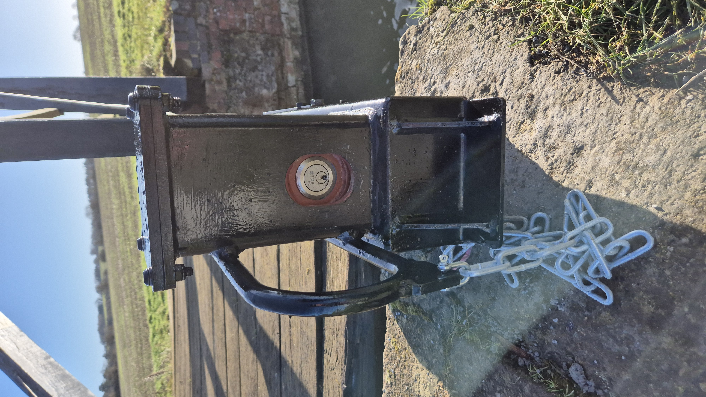
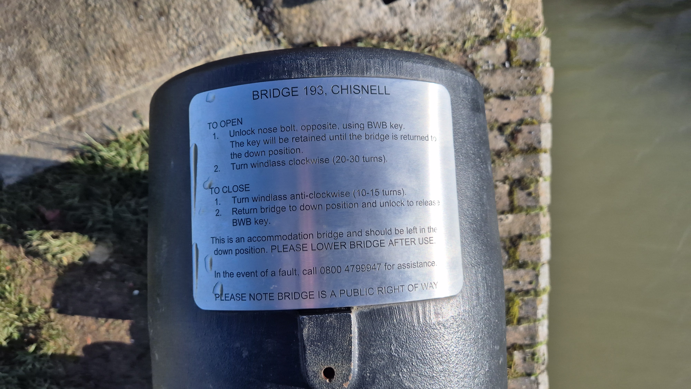
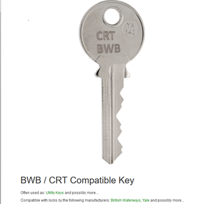

# Locking Mechanism on Lifting Bridge

The Canal Authorities have installed a locking mechanism so that now you need
a key as well as the standard lock key in order to operate the bridge, and the key
is not removable unless the bridge is lowered.

Instructions on the use of the key have been attached to the mechanism for some time:

Hopefully this will prevent repeats of the incidents since the
hydraulic mechanism was installed last year when the bridge has been
left up, blocking access to the other side of the canal, despite the
bridge being a public footpath and right of way.

