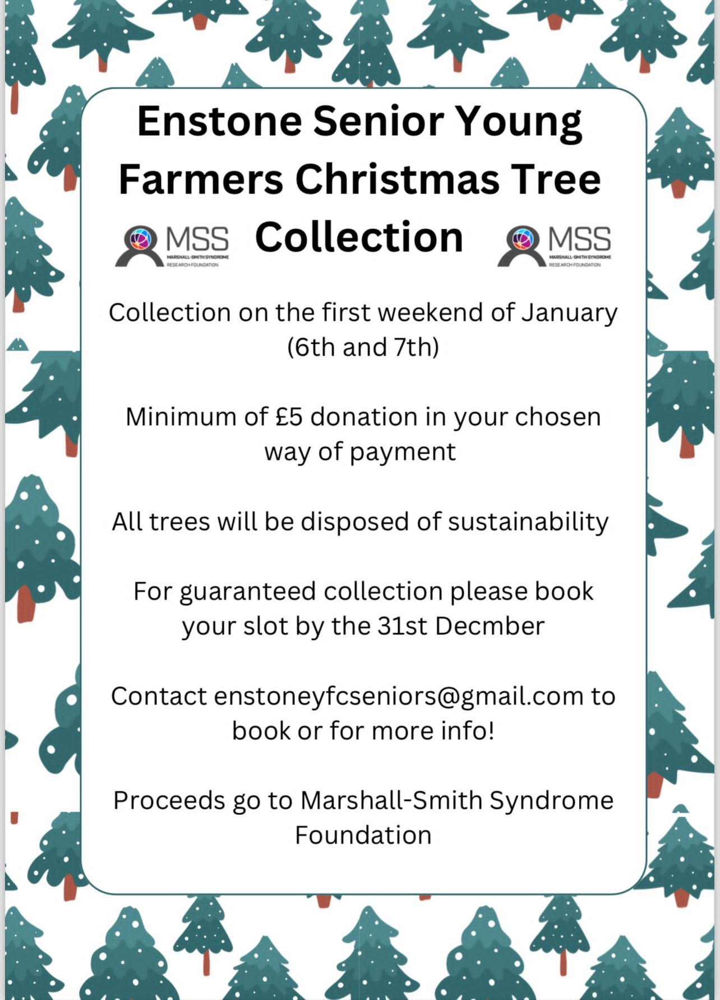

# Charity Christmas Tree Collection

On the 6th and 7th of January, members of Enstone Young Farmers will
be heading to local villages to come and collect your Christmas trees.

All money raised will be donated to the Marshall-Smith Syndrome
Foundation. This rare genetic condition predominantly affects the
growth and development of the bones, face and brain however also comes
with other complications such as difficulty breathing, and delayed
mental development. Some of our members have a special connection to a
little boy named Alfie who has this condition. Therefore the money
raised will enable the charity to fund more research about the
condition and help diagnose more people. 

If you would like to know
more about the charity please visit https://alfiesworld.co.uk

You can also use this form to book your collection.

<https://forms.gle/4Qd4s3LEZy7cFaEB6>

---

Matthew Carlisle

