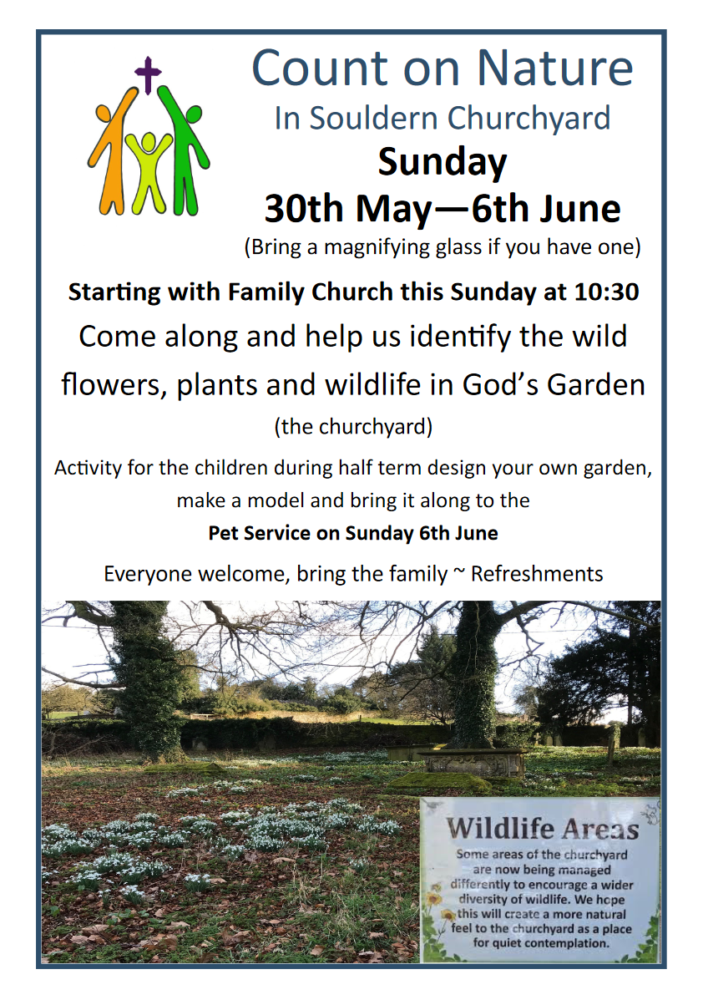

# Count on Nature In Souldern Churchyard 

     

**Sunday 30th May—6th June**

(Bring a magnifying glass if you have one)

Starting with Family Church this **Sunday at 10:30**

Come along and help us identify the wild
flowers, plants and wildlife in God’s Garden
(the churchyard)

Activity for the children during half term design your own garden, 
make a model and bring it along to the
Pet Service on **Sunday 6th June**

Everyone welcome, bring the family ~ Refreshments 
