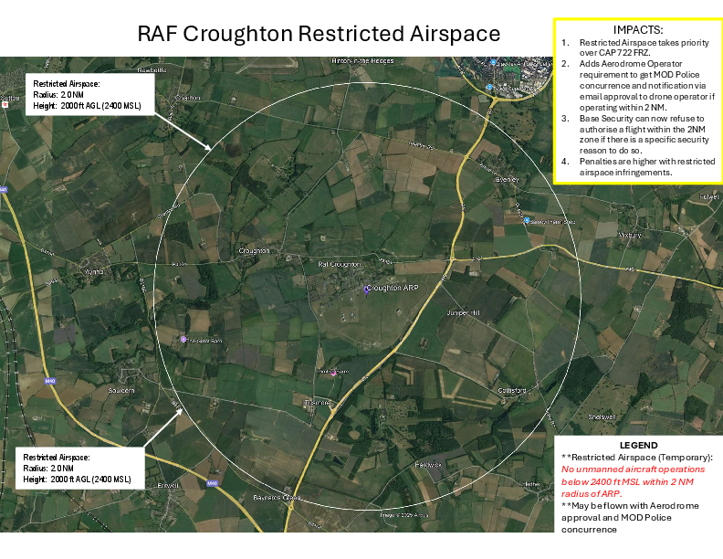

# Drone Use - RAF Croughton"

Please find attached a form provided by the Ministry of Defence
Police (MDP) containing information about the restricted airspace over
RAF Croughton in relation to drone use. The form is available for use
by anyone who may be considering flying a drone in this area and also
includes a map showing the two nautical mile (2 NM) exclusion zone to
make precise locations of the restrictions clearer to those
interested.

I would kindly ask that you share the document amongst the community
to help raise awareness of the airspace restrictions and support safe
and compliant drone operations.

Please do reach out if you have any questions, and I will ensure these
are directed to the appropriate person.

Kind regards,
 
Abby

----

Abigail Jeffs  
BA (Hons), PGCE, NPQLT
 
Community Relations Adviser  
RAF Croughton | US Visiting Forces Support Group

---

[PDF Form and Map](RAF Croughton Drone Operation form ver 2.4.pdf)