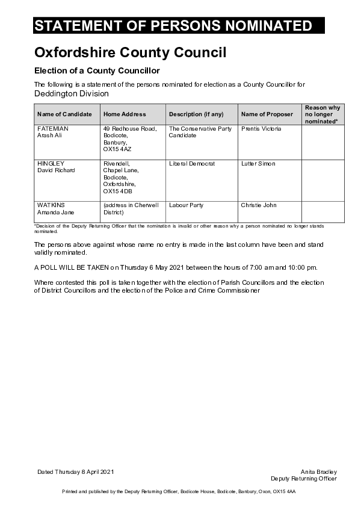
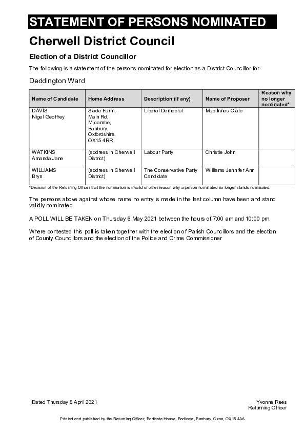

# Council Elections 2021

## STATEMENT OF PERSONS NOMINATED Oxfordshire County Council 

Election of a County Councillor 

The following is a statement of the persons nominated for election as a County Councillor for Deddington Division 

| Name of Candidate | Home Address | Description (if any) | Name of Proposer | Reason why  no longer nominated\* |
| FATEMIAN Arash Ali | 49 Redhouse Road,  Bodicote, Banbury,OX15 4AZ | The Conservative Party  Candidate | Prentis Victoria |
| HINGLEY David Richard | Rivendell, Chapel Lane, Bodicote, Oxfordshire, OX15 4DB | Liberal Democrat | Lutter Simon |
| WATKINS Amanda Jane | (address in Cherwell  District) | Labour Party | Christie John |

\*Decision of the Deputy Returning Officer that the nomination is invalid or other reason why a person nominated no longer stands  nominated.

The persons above against whose name no entry is made in the last column have been and stand  validly nominated. 

A POLL WILL BE TAKEN on Thursday 6 May 2021 between the hours of 7:00 am and 10:00 pm. 

Where contested this poll is taken together with the election of Parish Councillors and the election  of District Councillors and the election of the Police and Crime Commissioner

Dated Thursday 8 April 2021 Anita Bradley Deputy Returning Officer 

Printed and published by the Deputy Returning Officer, Bodicote House, Bodicote, Banbury, Oxon, OX15 4AA 

---

## STATEMENT OF PERSONS NOMINATED Cherwell District Council 

Election of a District Councillor 

The following is a statement of the persons nominated for election as a District Councillor for Deddington Ward 

| Name of Candidate | Home Address | Description (if any) | Name of Proposer | Reason why  no longer nominated\* |
| DAVIS Nigel Geoffrey | Slade Farm, Main Rd, Milcombe, Banbury, Oxfordshire, OX15 4RR | Liberal Democrat | Mac Innes Clare |
| WATKINS Amanda Jane | (address in Cherwell  District) | Labour Party | Christie John | 
| WILLIAMS Bryn | (address in Cherwell  District) | The Conservative Party  Candidate | Williams Jennifer Ann |

\*Decision of the Returning Officer that the nomination is invalid or other reason why a person nominated no longer stands nominated. 

The persons above against whose name no entry is made in the last column have been and stand  validly nominated. 

A POLL WILL BE TAKEN on Thursday 6 May 2021 between the hours of 7:00 am and 10:00 pm. 

Where contested this poll is taken together with the election of Parish Councillors and the election  of County Councillors and the election of the Police and Crime Commissioner

Dated Thursday 8 April 2021 Yvonne Rees Returning Officer 

Printed and published by the Returning Officer, Bodicote House, Bodicote, Banbury, Oxon, OX15 4AA 
