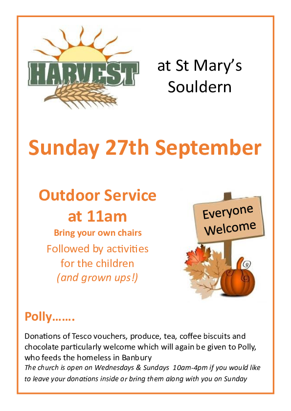

# Harvest at St Mary's Souldern

## Outdoor Service at 11am

*Sunday 27th September*

Bring your own chairs

Followed by activities 
for the children  
(and grown ups!)

Everyone  
Welcome

## Polly…….

Donations of Tesco vouchers, produce, tea, coffee biscuits and
chocolate particularly welcome which will again be given to Polly, who
feeds the homeless in Banbury

## Church Open

The church is open on Wednesdays &
Sundays 10am-4pm if you would like to leave your donations inside or
bring them along with you on Sunday
