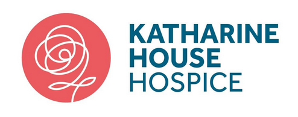

# Katherine House Hospice

## Springing into action

Just like this time of year, we’ve got lots of exciting things coming up! From new partnerships and
improvements, to a whole range of incredible events to raise money for our hospice. It’s thanks to
your ongoing support, we can continue to care for local people and families when they need us the
most.

## New lease of life for Banbury shop

We’re excited to announce that we have signed a new 10-year lease and will be staying right
where we are – at the heart of the Banbury community.
But that’s not all. We will also be giving our Banbury shop some TLC with a revamp that will make
the most of all the fantastic donations we receive, as well as improve the shopping experience. 

## Recycle more with Paw Paw

As part of an exciting recycling initiative, Paw Paw will donate 5p to Katharine House for every
plastic container that is returned in good condition when a customer orders their next meal. It’s
great news for our hospice and also helps cut down on plastic waste! The recycling scheme
runs across all three of Paw Paw’s Chinese takeaways in Banbury, Leamington and Warwick.

## Growing our Open Gardens

We’re always touched by the enthusiasm of our supporters to open their gardens for us – and
we’d love to see our events grow...
You can find out more about how to get involved and where this year’s events will be taking place
on our website. We already have six Open Garden events lined up! But keep checking back for
others added throughout the year.

## High and mighty

Are you looking for a BIG challenge this year? Then why not sign up for the world’s highest static
abseil? At a staggering 127 metres tall, the National Lift Tower in Northampton makes Big Ben
look positively little! Our Extreme Abseil event is taking place on 2 April and we’d love YOU to be
part of Team Katharine House and help us to raise money for our hospice.

## A run for everyone

The Blenheim Fun Run is back and taking place on 15 May. Run, jog or walk in the spectacular
grounds of the World Heritage site in Oxfordshire – and raise money for Katharine House at the
same time. The beauty of the Blenheim Fun Run (aside from the stunning grounds) is that you can
choose from the main 7km race, the 4-mile run suitable for buggies or wheelchairs, or the 1-mile
route for under 15s. There’s even an event for dogs so your four-legged friends don’t miss out!

## On your bike!

Are you ready for the ride of your life? The RideLondon-Essex 100 event is taking place on 29
May and we’ve managed to secure three places to ride in this highly sought-after event. If cycling
100 miles on traffic-free roads through the heart of London and neighbouring Essex sounds like
the event for you, then sign up today.

## Find out more 
Head to our website for more details, events and news: [www.khh.org.uk](https://www.khh.org.uk).
