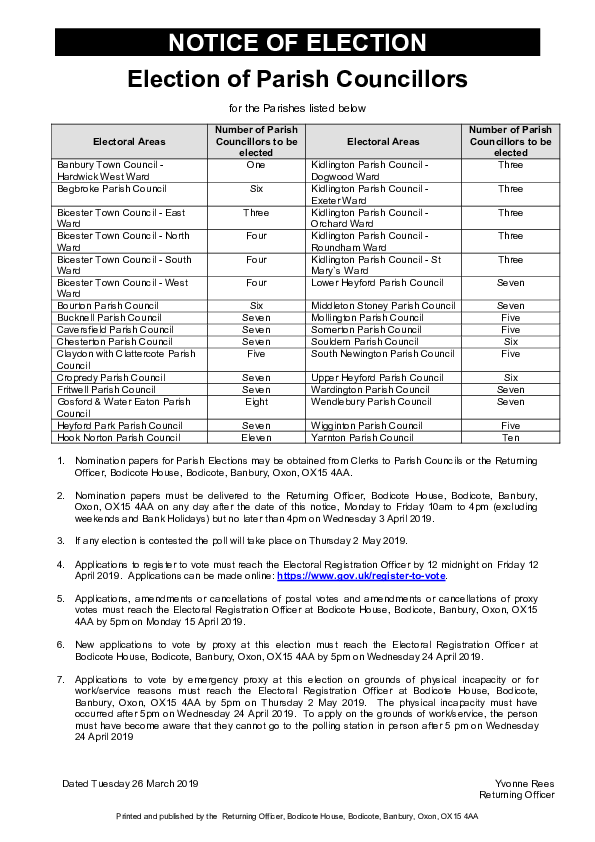

# Election of Parish Councillors

1. Nomination papers for Parish Elections may be obtained from Clerks to Parish Councils or the Returning Officer, Bodicote House, Bodicote, Banbury, Oxon, OX15 4AA.
2. Nomination papers must be delivered to the Returning Officer, Bodicote House, Bodicote, Banbury, Oxon, OX15 4AA on any day after the date of this notice, Monday to Friday 10am to 4pm (excluding weekends and Bank Holidays) but no later than 4pm on Wednesday 3 April 2019.
3. If any election is contested the poll will take place on Thursday 2 May 2019.
4. Applications to register to vote must reach the Electoral Registration Officer by 12 midnight on Friday 12 April 2019. Applications can be made online: https://www.gov.uk/register-to-vote.
5. Applications, amendments or cancellations of postal votes and amendments or cancellations of proxy votes must reach the Electoral Registration Officer at Bodicote House, Bodicote, Banbury, Oxon, OX15 4AA by 5pm on Monday 15 April 2019.
6. New applications to vote by proxy at this election must reach the Electoral Registration Officer at Bodicote House, Bodicote, Banbury, Oxon, OX15 4AA by 5pm on Wednesday 24 April 2019.
7. Applications to vote by emergency proxy at this election on grounds of physical incapacity or for work/service reasons must reach the Electoral Registration Officer at Bodicote House, Bodicote, Banbury, Oxon, OX15 4AA by 5pm on Thursday 2 May 2019. The physical incapacity must have occurred after 5pm on Wednesday 24 April 2019. To apply on the grounds of work/service, the person must have become aware that they cannot go to the polling station in person after 5 pm on Wednesday 24 April 2019

Dated Tuesday 26 March 2019

Yvonne Rees Returning Officer

