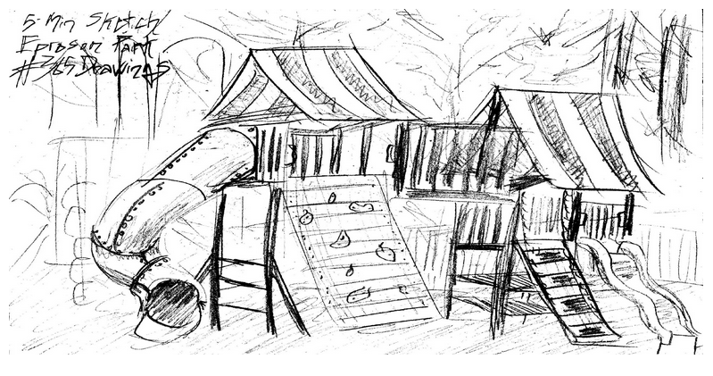
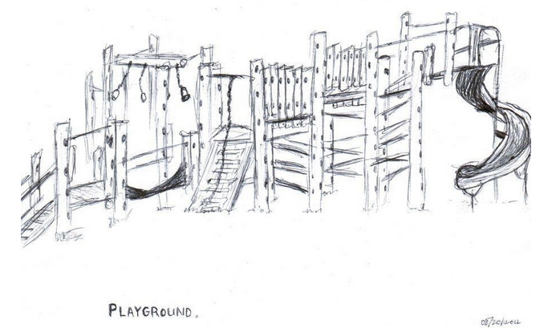

## Playground Update

Having held a public meeting earlier in the year, which gave full support to the playground redevelopment we  are now asking the village to help with ideas to design a space which can be multi generational – **we particularly would welcome the input of the teenagers (and ‘Big Kids’)** … who remember what they loved as toddlers but who also know how they would like to use it now.

So to this end the Playground group in conjunction with the Parish Council are launching a competition for the best design, which will have two age groups;

---

### Up to 12

Draw and colour/paint/decorate a playground with your favourite playground equipment, thinking of all the playgrounds you visit and what you think might be fun to play on in Souldern village playground

### 12 and above

Design a multi generational play park using the available space in the park which would include equipment for Under 10’s and equipment/space for older children and adults  – it can be done in any media – drawing, computer model…

---

All entries to be sent via email to [admin@souldern.org](mailto:admin@souldern.org)  by **30th April**.

---

All entries will be posted to [This website](home/playground2020/).

Winning entries will be decided by the playground committee and will receive a mystery prize.

It’s a mystery prize because we are not sure what best to give in the current lockdown situation, but we’ll come up with something!!!

---

<!--

https://365drawingsin2012.wordpress.com/2012/01/08/january-8th-eproson-park/
https://www.pinterest.com/pin/307300374567667710/
-->
