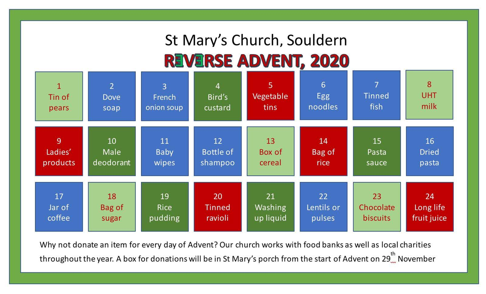

# Reverse Advent Calendar

## St Mary's Church

This Advent, why not focus on giving something back each day?

St Marys church is asking for donations of food and other essentials,
based on a Reverse Advent calendar. Any donation is welcome so long as
it’s non-perishable — it really doesn’t have to be French onion soup
but they don’t put Calling Birds in tins!

Throughout the year, we support the food banks in Bicester and Heyford
Park as well as a local charity which feeds the homeless in Banbury.

If you would like to help this Christmas, our usual food donation box
will be in the porch from  Sunday 29th November. This is emptied every
day.

