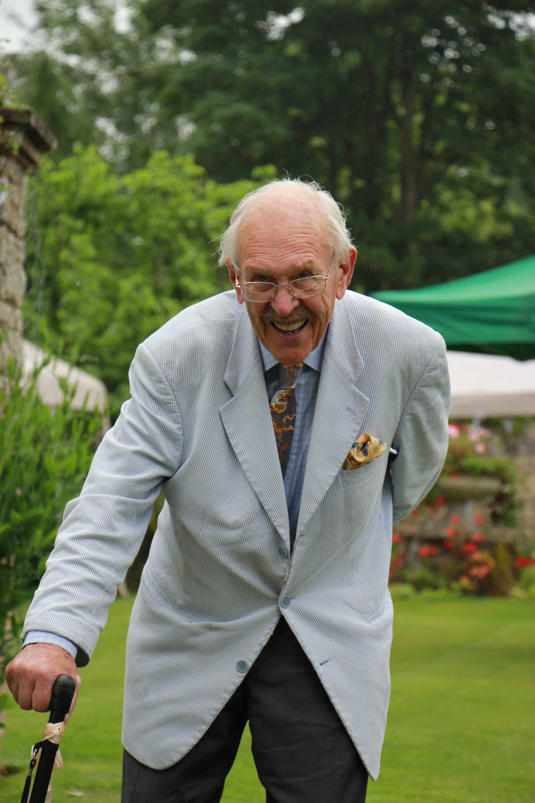

# Obituary: Alexander Harry Gray
## (14.12.1924-14.11.2020) – Sandy

Sandy was born in Bombay 96 years ago this month. His father, Sir Alexander
George Gray, was a bank manager there. He returned to England with his
mother, Dulce, and older sister, Diné, just before his 4 th birthday and from then
on spent from April to September with his mother and nanny in Berkshire
where they lived on a small farm and the rest of the year with his grandparents
and nanny in Berkhamstead. His mother went back to India every winter. His
father came home on leave every 5 years!

After school at Charterhouse and a year at Cambridge studying French and
German, he was called up in 1943 aged 18 and joined the Tank Battalion of the
Grenadier Guards. He was too young to be at D Day but by August 1944 the
Battalion had lost so many men that he was sent over as a reinforcement aged
just 19. He was extremely proud of the Legion d’Honneur recently awarded to
him by the French President for the small role he played in liberating France.
He spent the next 6 months pushing across France, Belgium and Holland and in
February 1945 he was in one of the leading tanks in Operation Veritable (the
allies’ final push into Germany) and the first to cross the Siegfried Line. He
never made it over the Rhine as his tank was hit by a bazooka. He was
wounded in the leg and spent the next 3 months in hospital in England.
Sandy stayed in the army for another 20 years, being posted to the Middle
East, Hong Kong and Canada and doing ceremonial duties in London. He and
Diana were married in 1958. In 1964 he decided to leave the army and
become a Chartered Surveyor. He worked at Haslam’s in Reading starting at
£5 per week whilst at the same time completing a correspondence course and
putting an extra floor on the family home, doing a lot of the work himself to
gain good practical experience. Once qualified he did a stint working at the
District Valuers in Oxford but in 1970 he was offered a job at Savills in Banbury
and came to Souldern where he and Diana lived so happily for virtually half a
century, bringing up 3 children and enjoying partaking in every aspect of
community life. He had a big input in the building of the new Village Hall and
got the playing field (where children had not been allowed to play until after
the hay had been cut) into a proper recreation ground. For the Queen’s Silver
Jubilee he organised a committee meeting which decided to plant trees round
the Rec and put up playground equipment. He thought that it would be easier
if there were no more meetings so he went to every house to collect money,
acquired the playground equipment which was erected with the help of
villagers, got all the children to plant the trees and ‘Postman Pat’ to deliver a
message from the Queen by helicopter (rare transport in those days!) during
the afternoon’s celebrations.

Sandy supported the church throughout 5 decades, getting lottery funding for
re-hanging the bells, replacing rotten flooring, installing the heater guards etc.
and was in charge of the churchyard for many years. He was Treasurer and
started the Church Fabric Repair Fund and was disappointed not to get the
solar panels on the roof. He instigated the car boot sales and in 1991 the first
Open Gardens. He was chairman of the Souldern Charity and oversaw the
modernisation of the two cottages. He raised the money to have a new roof
for the Chapel. He was chairman of the Wood Committee, helping to create
the wood where he spent many happy hours planting and then splitting up
primroses and snowdrops, being amazed that he had lived long enough to see
the trees grow. He installed the flagpole on the Rec and one of his joys was
raising the flag on village or royal occasions. He could often be seen doing
engineering work on the track up to Nancy’s Wood, either breaking up stones
and rubble to fill the holes, cutting back nettles or digging out little dykes to
drain the water. One of his proudest moments was when he was made a
Fellow of St. Birinus, a badge given by the Bishop, to acknowledge work done
in both the Church and the Village. When not busy tinkering in his workshop
or around the village, he loved welcoming anyone to his beloved house and
garden!

Diana and the family are very sorry that so few are allowed to attend his
funeral at St. Mary’s on what would have been his 96th birthday, 14th December
2020 at 11.30, but hope it will be live-streamed and available to view via a
web-link. Please contact Humphris Funerals on 01295 265 424 for details of
this and any other enquiries.

_Diana Gray_
