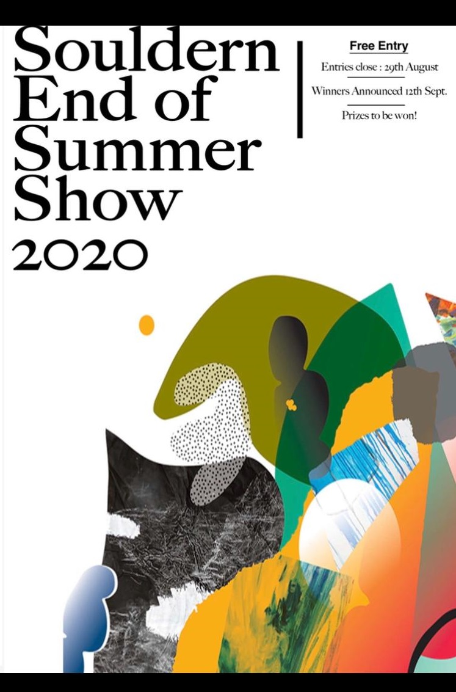

# Souldern End of Summer Show 2020

On the basis that nearly everything fun has had to be cancelled this year, the Solstice group wanted to find a way of giving the Community an opportunity to get competitive whilst having some fun at the same time. As a village we've lost Wacky races/ Horticultural society Show and the Cheese and Wine this summer, so we've tried to replace them with a “show” that will also create a gallery of what we got up to during COVID lockdown.

Please get involved where you feel able to, there are no entry fees, and hopefully there is a class or two that everybody can have a go at. If you need any assistance in getting your entries organised please contact one of the community support network and they will point you in the right direction.

Whilst it is a competition, with prizes, we are not expecting it to be taken to seriously............and bribery/corruption is actively encouraged....as long as its creative and done with a certain Terry Thomasesque flair!!!! (Look him up on youtube if you don't know him).

Anyway, please get involved, have fun and we look forward to seeing the fruits of your labours in early September.

The Solstice Collective

## Classes and instructions for entry

Please see the [Event Page for full list of classes and instructions](../events/summer-2020/)
     

