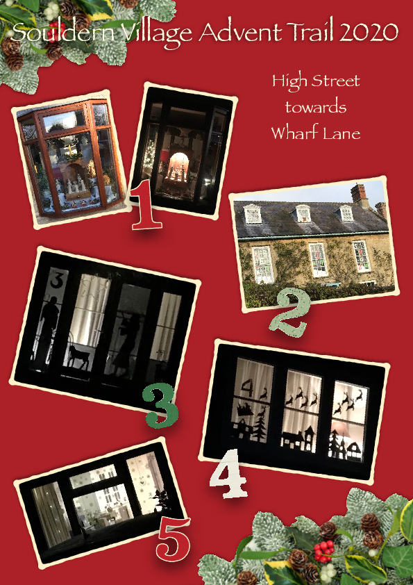
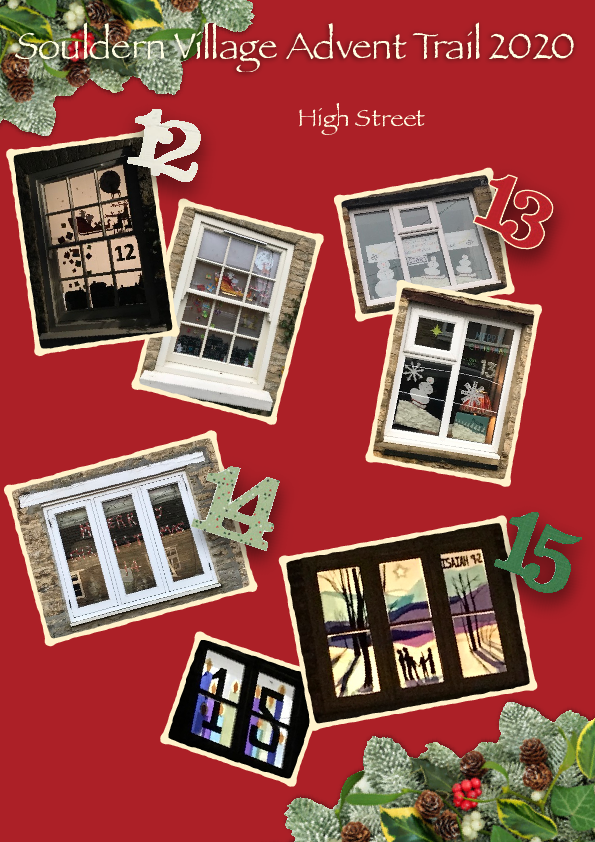
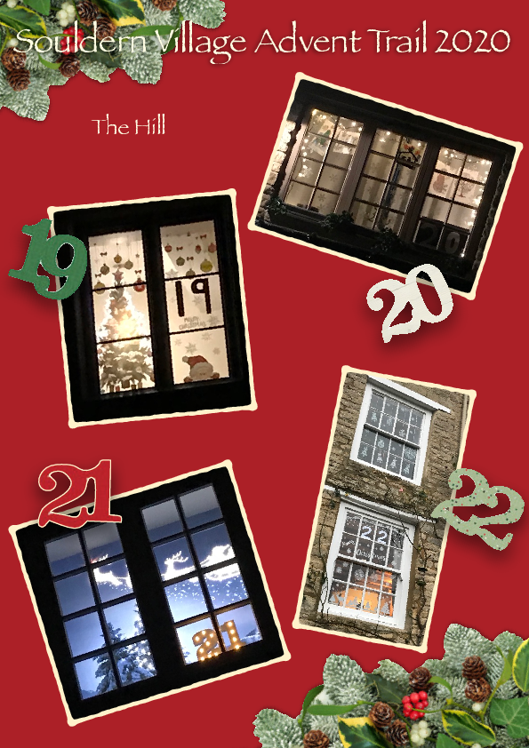

# Souldern Advent Trail 2020

The advent trail will begin on the 1st December! 

Look out for decorated windows and follow the trail as it winds
through the village, starting from The Old Post Office on the High
Street. Some windows may be better viewed by day, some by night, so
feel free to view the windows at a time of day to suit you each day,
or pick up the trail each weekend!

Please make sure you respect all government guidelines in relation to
COVID-19 pertaining to our area when viewing windows or following the
trail. Be aware of numbers of people in your group and any that you
meet from other households, maintaining appropriate social distancing
at all times.

Anyone in the village wishing to decorate their windows is encouraged
to join in the festive fun in a ‘free for all’ during the week before
Christmas. The aim is to bring as much festive cheer at the end of an
unusual year!

---

[Original announcement](souldern-advent-2020)
