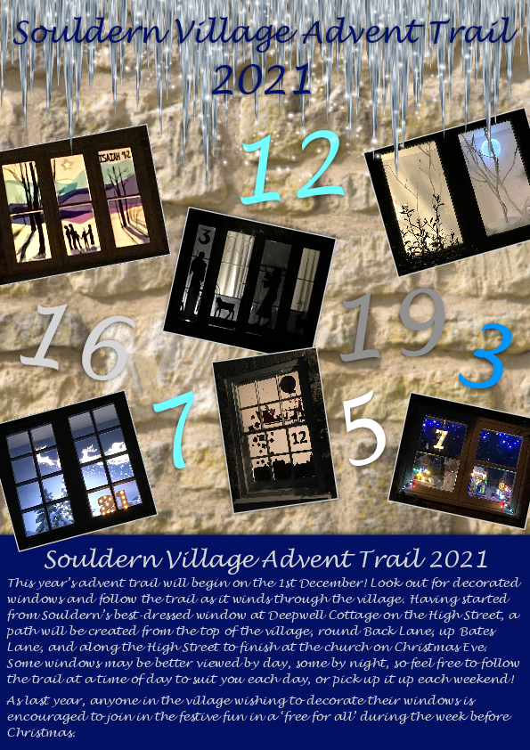
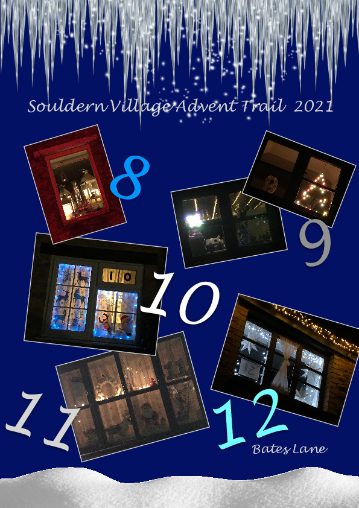

# Souldern Advent Trail 2021

The advent trail will begin on the 1st December! 

Look out for decorated
windows and follow the trail as it winds through the village. Having started
from Souldern’s best-dressed window at Deepwell Cottage on the High Street, a
path will be created from Bovewell at the top of the village, round Back Lane, up Bates
Lane, and along the High Street to finish at the church on Christmas Eve.
Some windows may be better viewed by day, some by night, so feel free to follow
the trail at a time of day to suit you each day, or pick up it up each weekend!

As last year, anyone in the village wishing to decorate their windows is
encouraged to join in the festive fun in a ‘free for all’ during the week before
Christmas.

---

---

[Original announcement](souldern-advent-2021)
