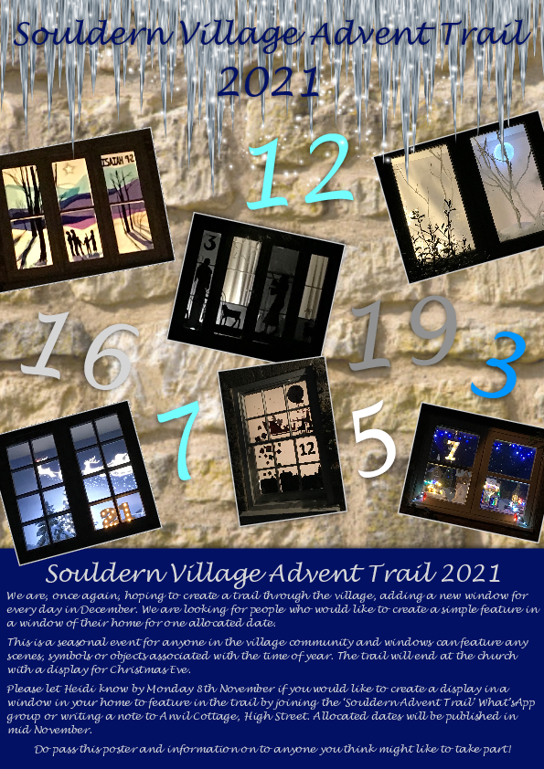
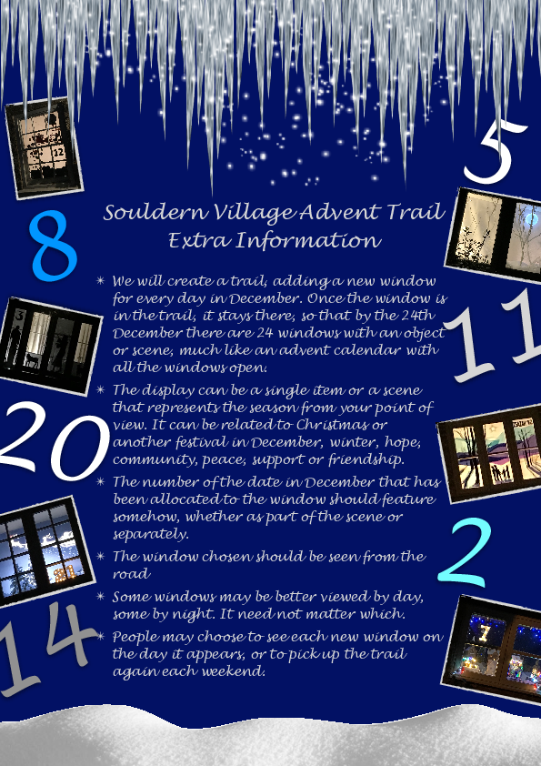

# Souldern Village Advent Trail 2021

We are, once again, hoping to create a trail through the village, adding a new window for
every day in December. We are looking for people who would like to create a simple feature in
a window of their home for one allocated date.

This is a seasonal event for anyone in the village community and windows can feature any
scenes, symbols or objects associated with the time of year. The trail will end at the church
with a display for Christmas Eve.

Please let Heidi know by Monday 8th November if you would like to create a display in a
window in your home to feature in the trail by joining the ‘Souldern Advent Trail’ What’sApp
group or writing a note to Anvil Cottage, High Street. Allocated dates will be published in
mid November.

Do pass this poster and information on to anyone you think might like to take part!

---

[PDF poster](Souldern Village Advent Trail 2021.pdf)

---

## Souldern Village Advent Trail Extra Information

 ✴ We will create a trail, adding a new window
for every day in December. Once the window is
in the trail, it stays there, so that by the 24th
December there are 24 windows with an object
or scene, much like an advent calendar with
all the windows open.

 ✴ The display can be a single item or a scene
that represents the season from your point of
view. It can be related to Christmas or
another festival in December, winter, hope,
community, peace, support or friendship.

 ✴ The number of the date in December that has
been allocated to the window should feature
somehow, whether as part of the scene or
separately.

 ✴ The window chosen should be seen from the
road

 ✴ Some windows may be better viewed by day,
some by night. It need not matter which.

 ✴ People may choose to see each new window on
the day it appears, or to pick up the trail
again each weekend.

