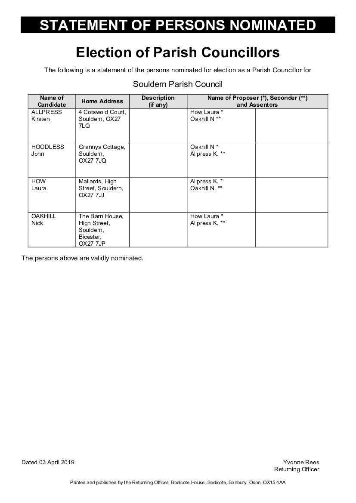

# Election of Parish Councillors 

The following is a statement of the persons nominated for election as a Parish Councillor for Souldern Parish Council 

| **Name of Candidate** |  **Home Address** | **Description** (if any) | **Name of Proposer (\*), Seconder (\*\*) and Assentors** |
| ALLPRESS Kirsten  | 4 Cotswold Court, Souldern, OX27 7LQ | | How Laura \* Oakhill N \*\* |
| HOODLESS John     | Grannys Cottage, Souldern, OX27 7JQ  | | Oakhill N \* Allpress K. \*\*  |
| HOW Laura         | Mallards, High Street, Souldern, OX27 7JJ | | Allpress K. \* Oakhill N. \*\* |
| OAKHILL Nick      | The Barn House, High Street, Souldern, Bicester, OX27 7JP | | How Laura \* Allpress K. \*\* |

The persons above are validly nominated. 

Dated 03 April 2019 Yvonne Rees Returning Officer 

Printed and published by the Returning Officer, Bodicote House, Bodicote, Banbury, Oxon, OX15 4AA 

