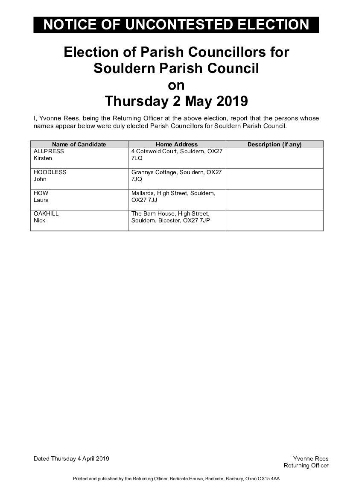

# NOTICE OF UNCONTESTED ELECTION

##      Election of Parish Councillors for Souldern Parish Council
##                            on
##               Thursday 2 May 2019

I, Yvonne Rees, being the Returning Officer at the above election, report that the persons whose
names appear below were duly elected Parish Councillors for Souldern Parish Council.

| **Name of Candidate** |  **Home Address** | **Description**  (if any) |
| ALLPRESS Kirsten  | 4 Cotswold Court, Souldern, OX27 7LQ |
| HOODLESS John     | Grannys Cottage, Souldern, OX27 7JQ  |
| HOW Laura         | Mallards, High Street, Souldern, OX27 7JJ |
| OAKHILL Nick      | The Barn House, High Street, Souldern, Bicester, OX27 7JP |

Dated Thursday 4 April 2019

Yvonne Rees  
Returning Officer

