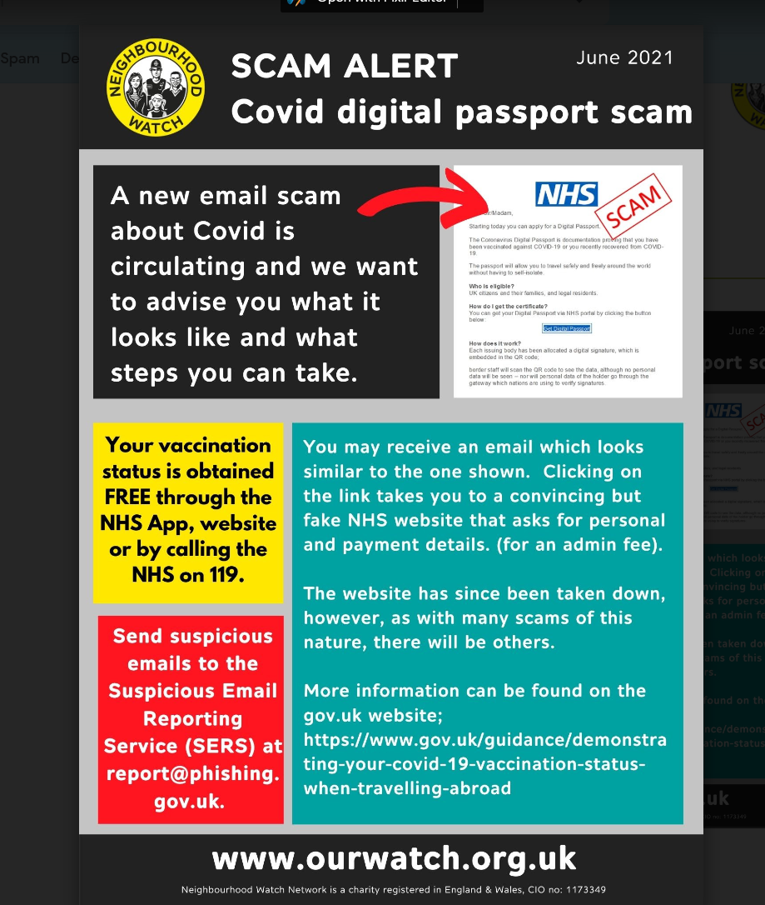

# Vaccine Passport Scam

We have been made aware of a Covid Vaccine Passport scam email going around that purports to be from the NHS and informs recipients that they can apply for their “Digital Coronavirus Passports”

Clicking on the link within the email, takes you to a convincing but fake NHS website that asks for personal and payment details. (for an admin fee)

The website has since been taken down, but in case similar emails/websites appear can you please circulate the attached alert to your residents, members, groups and mailing lists.

And just to reiterate, your vaccination status is obtained FREE through the NHS App, website or by calling the NHS on 119.

More information can be found on the [gov.uk website](https://www.gov.uk/guidance/demonstrating-your-covid-19-vaccination-status-when-travelling-abroad).

Please note that any Phishing scams can be reported to  SERS (Suspicious Email Reporting Service):  report@phishing.gov.uk

Best wishes

NEIGHBOURHOOD WATCH NETWORK, Central Support Team

Neighbourhoood Watch Network is a charity registered in England & Wales, CIO no: 1173349
 
