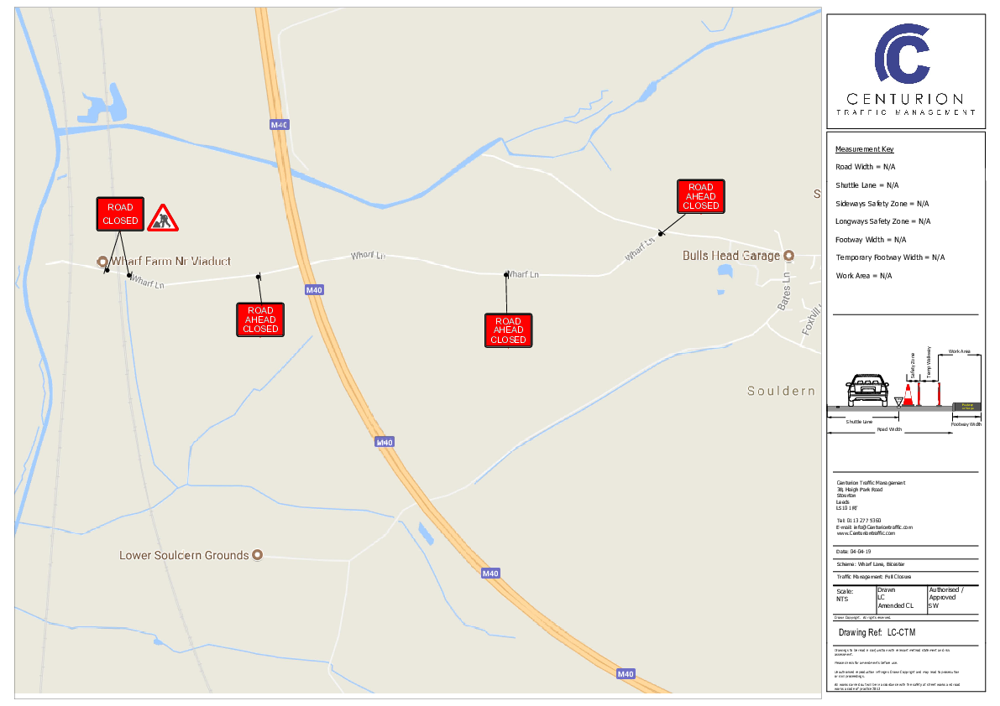

# Temporary Traffic Regulation Order – S14 Road Traffic Regulation Act 1984

## Temporary Road Closure at Souldern, Wharf Lane, Bicester

 

A request has been received from Centurion Traffic Management for a temporary road closure to apply to a section of Wharf Lane, whilst essential tactile examination of the bridge works are carried out.

 

A Temporary Traffic Regulation Order (TTRO) is being made to implement the temporary closure and will operate on **03 January 2021**. This will operate between **07:30 to 14:30**

 

(The maximum duration of a TTRO on a road is 18 months and on a footpath is 6 months, or until completion of the works, whichever is the earlier.)

 

 

Notice of intention to make the Order will be published in the local press.

 

A copy of the drawing showing the extent of the closure and also the alternative route for traffic is attached.

 

Further information regarding the works may be obtained by contacting Tom Rodgers on 01132 775360 or email tom.rodgers@centuriontraddic.com

 

T8190/AC

 

 

Regards,

 

Angel Collodel

Officer  
Network Management  
Communities

Oxfordshire County Council

Mobile: 074367 01072

Email:    Angel.Collodel@oxfordshire.gov.uk

