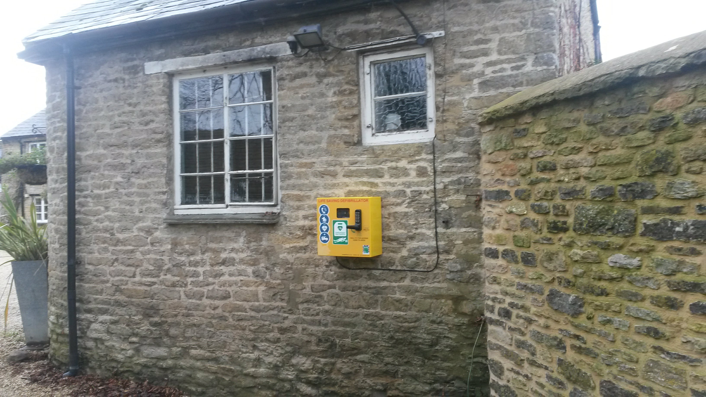
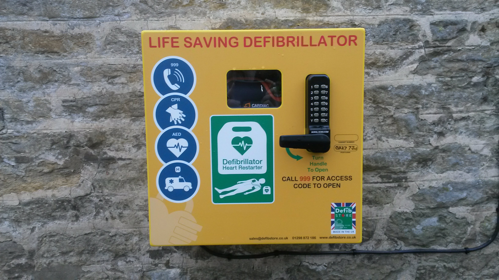

# Village Defibrillator

There is a defibrillator in the
[centre of the village](https://www.google.co.uk/maps/@51.9795133,-1.2435921,18z),
attached to the Fox Public House.

If an emergency arises and you need to use the device, phone the
Ambulance Service via 999 and they will give you the access code to
open the case to the defibrillator. The machine itself will give spoken
instructions and lead you through the process of applying the device
to the patient and applying CPR if necessary.

If you wish to familiarize yourself with the operation of the
defibrilliator  the model installed is
the **Powerheart G5 Semi Automatic with CPR Feedback**

Below is a video and a link to a PDF brochure from the manufacturer
showing the use of the machine.

<iframe width="686" height="315" src="https://www.youtube.com/embed/xkcD3Mv9oAU" frameborder="0" allow="accelerometer; autoplay; encrypted-media; gyroscope; picture-in-picture" allowfullscreen></iframe>

[PDF](G5-Brochure.pdf)