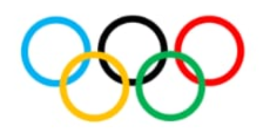

## The SSSC presents

# SOULDERN 2024 Faux Olympiques

## 22nd June

## Timings On The Day

Teams of 5 people (all ages) are invited to enter six Olympic themed
events with a French twist to be held around the vilage, c30mins per
event between 2pm and 5pm.

Teams will be required to meet in The Fox car park at 1:30pm to
receive instructions. Full detals of the events will be shared on the
day. We encourage teams to be made up of different age groups and
dress accordingly to participate in leisurely activities such as
croquet and ones slightly more physically demanding such as a 4000m
team timed rowing challenge. Don't let the rowing put you
off, a minimum of two team members can do the hard work.

Points will be awarded to each team and the winning team will be
invited to recelve their gold medals at 6:30pm.

Should you have any queries please DM either Rob Large or Nick
Oakhill. It would assist if teams can pre-register so that we can
gauge numbers.

For those who fancy a less energetic afternoon a treasure hunt will be
avalable on the day to encourage villagers to walk the grounds and
find Olympic themed objects. Further details to follow from Alan
Smith.

The Fox will be providing the BBQ between 5pm and 7pm and will be
selling tickets from the bar leading up to the ovent. Further details
will be posted by The Fox. We encourage villagers to bring desserts
for sharing based on Olympic or French themes. Further details to
follow from Linda Maws and Amanda Sharman. Live music will be provided
after 7pm.

Finally, an Olympic biscuit bake off will be held for the
children. All entries to be delivered to The Fox by 4pm on the day.

