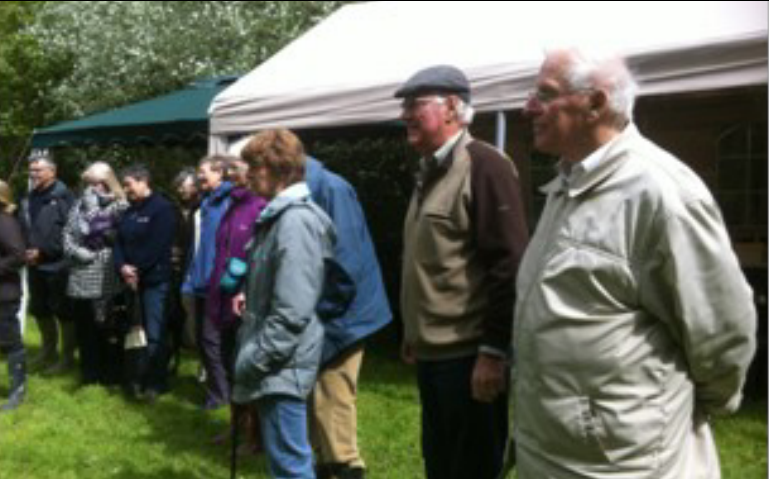
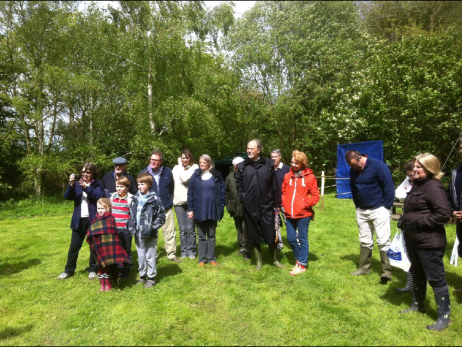

# 11th May 2014: Oak Apple Day

By tradition, Oak Apple Day was the day on
which the Souldern Friendly Society, known
locally as The Souldern Club, held its Annual
General Meeting. The club was founded in 1816
to give financial help to men who were prevented
by sickness from working to support their families. On Oak Apple
Day members of the club, wearing oak apples or oak leaves in their
caps, marched from the school to the church for a thanksgiving
service. They then returned to the school for a feast. Entertainment
for the villagers was provided until late at night by a fair on the village
green, almost opposite today's Secret Garden.

With the coming of the Welfare State the need for the club waned
and the society was wound up in 1935. Following the planting of
Nancy Bowles Wood in 1986, village picnics were held there from
time to time and the present management group likes to celebrate
this event bi-annually, in spring.

Further information about The Souldern Club can be found in Robert
Hitchman's three ‘Journey from the Turnpike’ booklets (sadly now
out of print), and in Ann Prescott's more recent book, ‘Souldern our
village in Oxfordshire’.
Romney Summers, Chairman of Nancy Bowles Wood Management
Group

 - - -

## NANCY BOWLES WOOD, SOULDERN
## OAK APPLE DAY
## SUNDAY, 11th MAY 2014

You are warmly invited to this historic village event,
starting at 2.00pm in Nancy Bowles Wood (at the top of
the Bridleway from the bottom of Foxhill Lane). Please
bring a picnic although refreshments will be available.
There will be organised games for adults and children.

Nancy Bowles wood is a wonderful village amenity and
is there to be enjoyed by all so please do come along.

- - -

Report on Oak Apple Day 2014
The morning of May 11th 2014 dawned and our hearts
sank as we saw the grey skies and the wind, gathering
pace.

Relentless, we decided to carry on and a trusty group of
us, wood group members and volunteers worked from
10am for two hours and set the scene for our Oak
Apple Day, with Skittles, Aunt Sally, Toss the Beanbag,
Woodland Quizzes and a large Refreshment tent
together with shelters in case of, horror of horrors, rain.

The rain held off and at 2pm families began to trickle
up to the wood.

By 3pm there were about 50 people, not as many
children as in the past, which was unfortunate, but still a
healthy turnout.

The sandwiches and the cakes disappeared and old and
young took part in the games and quizzes.

All in all, in the end it was a lovely fun day, full of
community spirit and even the sun showed its face from
time to time.

Well done and many thanks to all the helpers. We
couldn't have done it without you.

