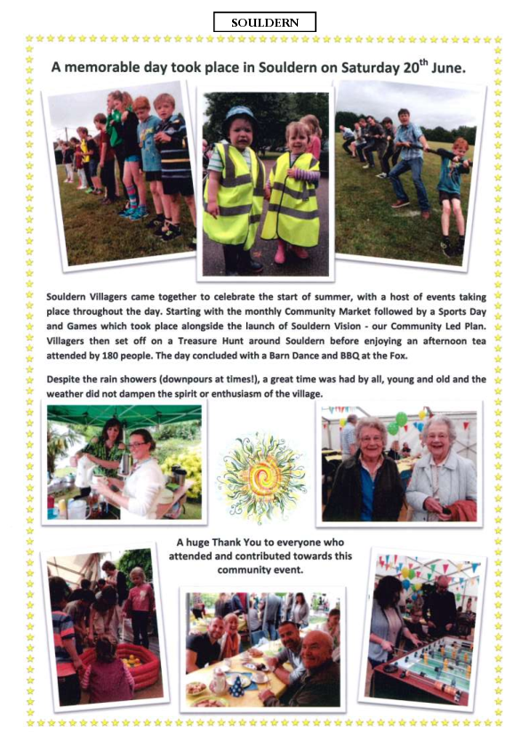

# Souldern Solstice 2015
A memorable day took place in Souldern on Saturday 20th June.

Souldern Villagers came together to celebrate the start of summer,
with a host of events taking place throughout the day. Starting with
the monthly Community Market followed by a Sports Day and Games which
took place alongside the launch of Souldern Vision - our Community Led
Plan. Villagers then set off on a Treasure Hunt around Souldern before
enjoying an afternoon tea attended by 180 people. The day concluded
with a Barn Dance and BBQ at the Fox.

Despite the rain showers (downpours at times!), a great time was had
by all, young and old and the weather did not dampen the spirit or
enthusiasm of the village.

A huge Thank You to everyone who attended and contributed towards this
community event.

