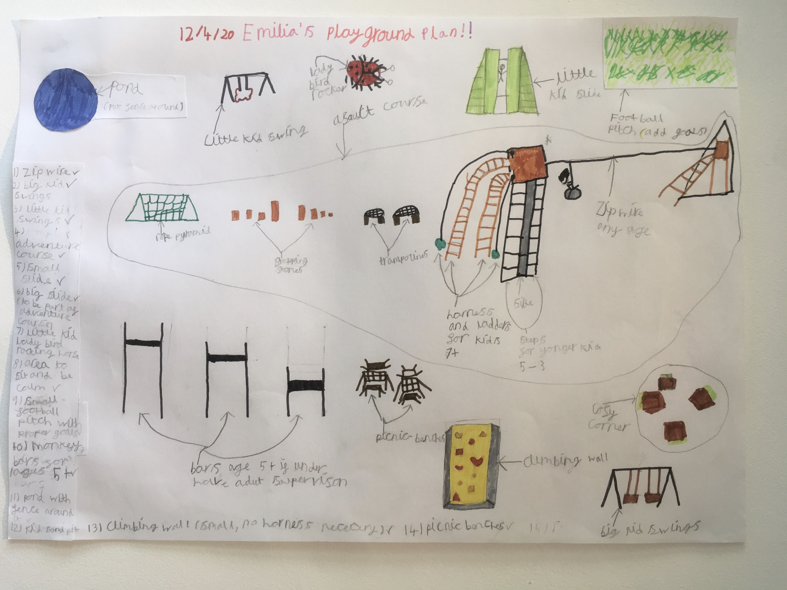
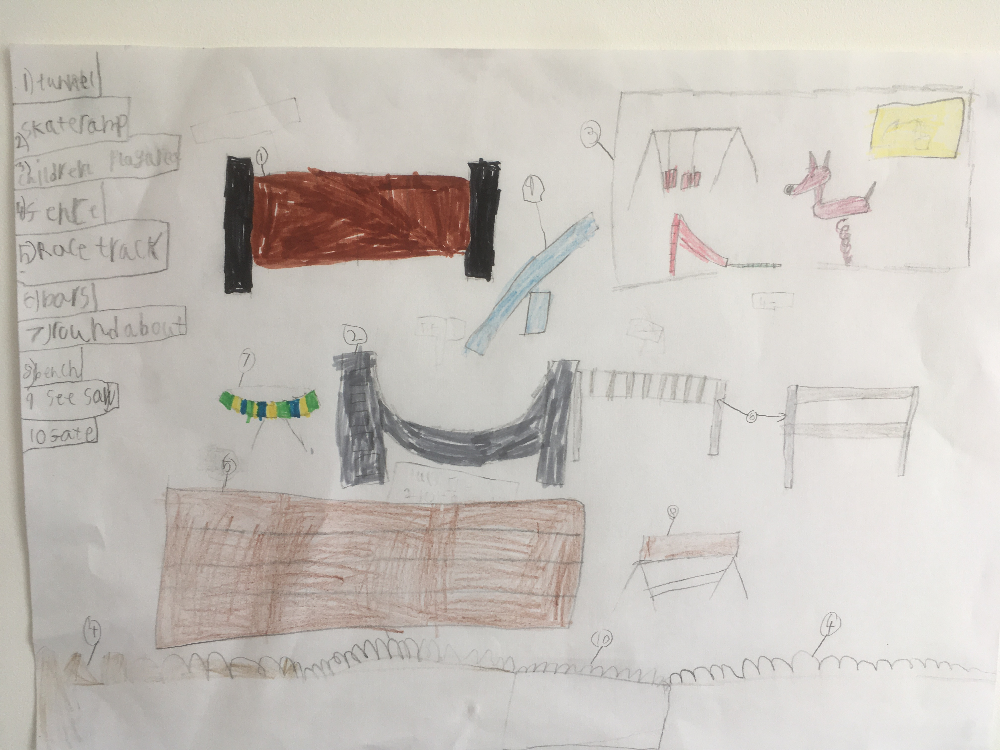

# PlayGround Design Competition

See the [Competition Annoucement](/home/announcements/playground-design-competition)

----

## Emilia Grundy (Age 9)

* Zip wire
* Big kids swing
* Little kids swing
* Adventure course
* Small slide
* Big slide (to be a part of the adventure course)
* Little kids ladybird shaped rocking horse 
* Area to sit and be calm 
* Small football pitch with proper goal nets 
* Monkey bars for ages 5 + 
* Pond with fence around
* Kids sandpit

----

## Samuel Grundy (Age 7)

* Tunnel 
* Skateboard ramp 
* Children's play area (small children)
* Fence 
* Race track (running track)
* Monkey bars
* Roundabout 
* Bench 
* Seesaw
* Gate

----
