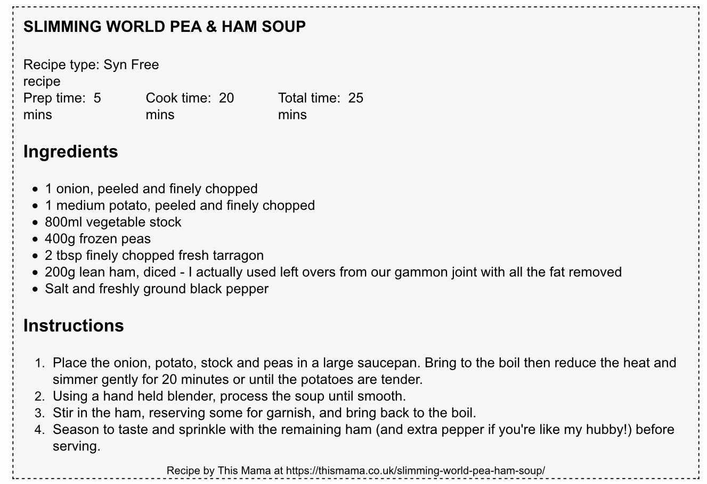

# Souldern Recipes

The Souldern Sports and Social club invide Souldern residents to
submit their favourite  recipes.

Either original texts or (with
reference) recommendations from publications.

**Contributions are encouraged**

Please send them to
  [website@souldern.org](mailto::webstite@souldern.org)
  or use the
  [Contact form on this site](/home/contact-website)

---

# Recipes

 * [Ham and Pea Soup](#ham-and-pea-soup-rob-large)
 * [Spaghetti Carbonara](#spaghetti-carbonara-rob-large)
 * [Cauliflower Cheese Soup](#cauliflower-cheese-soup-caroline-sartory)

---

## Ham and Pea Soup (Rob Large)

<a href="https://thismama.co.uk/slimming-world-pea-ham-soup">Cited from thismama.co.uk</a>

## Spaghetti Carbonara (Rob Large)

<a
href="https://www.slimmingworld.co.uk/recipes/spaghetti-carbonara">Cited
from Slimming World</a>

# Cauliflower Cheese Soup (Caroline Sartory)

Instead of boiling the cauliflower, I roasted it for 30 mins with a
couple of cloves of garlic.

>   **Ingredients**
>
>    knob of butter
>
>    1 large onion, finely chopped
>    
>    1 large cauliflower (about 900g/2lb), leaves trimmed and cut into florets
>    
>    1 potato, peeled and cut into chunks
>    
>    700ml vegetable stock (from a cube is fine)
>
>    400ml milk
>
>    100g mature cheddar, diced
>
>    **Method**
>
>    Heat the butter in a large saucepan. Tip in the onion and cook
>    until softened, about 5 mins, stirring often. Add the cauliflower,
>    potato, stock, milk and seasoning. Bring to the boil, then reduce
>    the heat and leave to simmer for about 30 mins until the
>    cauliflower is soft and the potato almost collapsing.
>
>    Whizz in a food processor or crush with a potato masher until you
>    get a creamy, thick soup. Top up with more milk to thin a little
>    if serving in mugs. You can make ahead up to 2 days in advance,
>    cool, cover and leave in the fridge until needed, or freeze for up
>    to 1 month. When ready to serve, warm through, ladle into mugs or
>    bowls, top with the cheese pieces, then stir through before
>    eating.
>    

<a
href="https://www.bbcgoodfood.com/recipes/cauliflower-cheese-soup">Cited
from BBC Good Food</a>

---

Original recipies contributed under <a
href="https://www.souldern.org/home/about#TOC-Licence">Creative
Commons Licence</a>, Excerpts of other publications cited with
reference to the copyright holder in each case.

