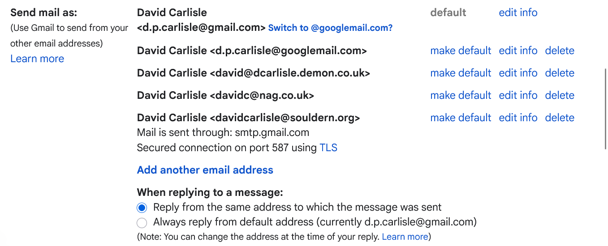

# Using souldern.org emails

# Receiving Email

To receive emails as someone@souldern.org the account needs to be
listed (By Nick Oakhill) at godaddy (that manages the souldern.org
domain) we have 100 free adddresses that can be used.

This account does not store any mail it is simply a forwarding address
to a "real" email account. Either your normal email or a custom
account set up just for the purpose such as
someone@souldernpc@gmail.com

If you just set up the email at godaddy there is nothing more that
needs to be done: email arrives to the associated email in the normal
way the "from" field lets you know the original person addressed it to
souldern.org, but you reply from your normal email program using your
normal email address (eg someone@souldernpc@gmail.com)

# Sending Email

It is possible to set things up so that you can also send from
someone@souldern.org (and optionally automatically send from that
account when replying to emails that were sent to the souldern.org
address)

This mechanism is still supported by google/gmail although they don't
particularly recommend it, and don't make it particularly easy to set
up (although it is easy to use once setup)

Google help page:

https://support.google.com/mail/answer/185833?hl=en-GB

# Advantages

The advantage of sending as souldern.org is that it keeps things more pbviously related to
the Souldern Domain.

# Disadvantages

While the mechanism described below is perfectly legitimate, it
authorises gmail.com's mail server to send emails "as if" from
souldern.org. This is recorded in the email headers so the email
system of the person receiving the email "knows" this.

As the forwarding site is gmail and it only does this when explicitly
authorised this is classed as relatively safe but some more paranoid
email systems may flag this as a potential "spoof" email or even
potentially ban it or mark it as spam. However there are many reasons
for emails being marked as spam, this forwarding mechansim may make it
slightly more likely but this is more likely to affect sending emails
to buisnesses than home email systems.

* 2FA
  If you want to try this then you must have two-factor authentication
  set up on your google account (this means that if you log in to google
  on a new device it will require more than just password, typically
  finger print or a text messag eto your phone, or whatever you set
  up.

  You can check this at
  
   https://myaccount.google.com/security

  It should show

    ![2fa status]{2fa.png)

* You will then need a so called "App Password" that lets specific
  programs (in this case gmail's own server) access based on your
  account.

  Log on to

  https://myaccount.google.com/apppasswords

  and generate a new password, you can give any name for the app
  I used "mailtest"

  ![app password]{apppwd.png)

  This will generate a password of four groups of 4 letters separated
  by spaces. Save this as you will need it in the next step, but then
  it should be deleted you will not need it again, these passwords are
  intended for one-off use, but they give access to your google
  account so should not be written down or left in unsafe places.

* Now go to the cog menu in gmail and select Settings then Acconts and
  Imports

  

  The **send mail as** lists all the email addrresses that you may
  currently use, and has a link at the bottom to add another.

  I have a couple of versions of the gmail address, my old home
  email. my work email and souldern.org.

  Also checked is an option to reply to emails using whichever account
  the email was sent to.

* Adding a new email account

  ![email1][email1.png)

  ![email2][email2.png)

# sending emails 

  ![sendemail][sendemail.png)

