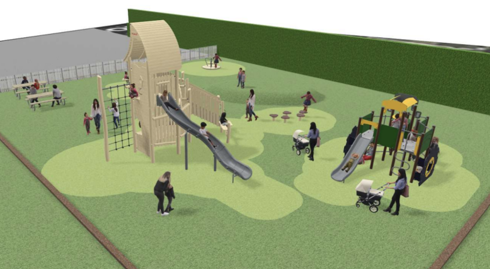

# Playground

----

## Playground Work 2021 &ndash; 2024

### Initial Groundwork, September 2023

## Playground Plans 2023 &ndash;

The project is now at the stage where fundraising must begin in earnest in order for the
village to be in a position to realise the plans. It is estimated that the total project will
cost approximately £150,000. Members of the playground advisory group, other
stakeholders and additional members of the village community have identified a number
of possible sources for grants. These need to be explored further with the help of
additional volunteers and local fundraising initiatives will also help add to the funds
which need to be raised.

If you are able to help in ways large or small, with either time
or expertise, please contact  
Alan [alans.souldernpc@gmail.com](mailto:alans.souldernpc@gmail.com)
or Heidi [heidi.souldernpc@gmail.com](mailto:heidi.souldernpc@gmail.com).

* [Launch Meeting](/home/announcements/playground-launch)
* [Outline Planning Poster](/home/announcements/playground-plan)

----

## Renovation Planning 2019 &ndash; 2022

The Playground is in need of Renovation. A consultation took place between 2019 and 2022.

* [Minutes of first meeting](/home/announcements/playground2020-minutes)
* [Announcement of first meeting and Survey form](/home/announcements/playground2020)
* [ROSPA Report on (**poor**) state of the playing field equipment](/home/announcements/playground-safety-2019)
* [Playground design competition](/home/announcements/playground-design-competition)  and [Submitted Entries](/home/playground2020).
* [Online questionnaire on the Playground usage](/home/announcements/playground-questionnaire-2021)
* [Slideshow showing the old playground being dismantled on 13th March 2021](demolition-march-2021)

